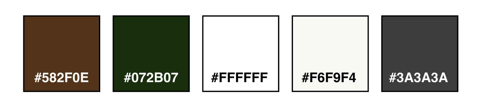

# Bokashi Simplified - A beginners guide
## Introduction

### Project Description
[Bokashi Simplified](https://behemot-biz.github.io/bokashi/)
is a site about bokashi composting, an efficient, anaerobic process that uses a specific group of microorganisms to ferment kitchen waste. 
### Project Purpose
My aim with this site is to demystifie the concept and encourage people to give it a try with a very basic step-by-step guide whithout overwhelming with technical and scientific text.

I use my own knowledge on the subject and I remember how daunted I felt before I actually dared to get going four years ago. 

### Look and feel on different devices

## User Stories
Bokashi simplified is designed to educate and engage visitors on the benefits of the bokashi method for economy, environment, and agriculture. The website consists of a homepage, a step-by-step guide, and a contact page.

### Homepage Visitor
**User story:**  As a new visitor, I want a clear and welcoming introduction, so that I can quickly understand what the website is about.

**End user goal:** I can quickly understand what the website is about and decide if it has the information I'm looking for.

### Guide User
**User story:**  As a user who needs help with the process covered by the guide, I want a clear and easy-to-understand step-by-step guide.

**End user goal:** I can easily follow each step and complete the process without confusion

### Contact Page User
**User story:**   As a user who needs additional help or has specific questions, I want to be able to fill out and send a simple contact form.

**End user goal:** I can quickly contact the people responsible for the website and get answers to my questions.

### Website Owner
**User story:**  As the owner of the website, I want the website to effectively communicate the benefits of the method through a well-structured homepage and a detailed step-by-step guide.

**End business goal:**  Visitors not only understand how the method works and the benefits it offers but are also motivated to try the method and possibly share the information with others.

### Conclusion
These user stories are designed to ensure that the website meets the needs of both its users and me as the owner, focusing on clarity, engagement, and actionable outcomes. They guide the development and content strategy to maximize the impact and usability of the website.

## Design decisions
### Fonts
I wanted contrast between headlines and bread text, I used the site fontpair.co for inspiration. 
I decided to use Playfair Display for all headlines and Source Sans 3 for bread text.

A quite funny thing, later when I was looking around for some inspiration I found the same headline font on a swedish site, selling all things needed for bokash composting, bokashi.se, so I guess it was a good choice.

### Colours
I selected brown and shades of green. Brown for the bokashi brans and the good soil it creates. Green for the great food I get when growing in the nutrient soil I get from the compost.

#### Colour use
- Brown #582f0e - Headlines on white background, logo, hamburger icon and footer 
- Green #072B07 - Headlines on pale green background
- Pale green #f6f9f4 - Background color
- White #ffffff - Background color, icons in footer
- White whith opacity #fffffff2 - Background color
- Dark grey #3a3a3a - Bread text and navigation text

### Imagery
I used my own pictures from my garden and family. I also took new pictures of the bokashi workflow to use as illustrations in the guide.

### Wireframes

I chose to use figma for wirefrane and prototyping. This is also where I wrote most of the textual content to make sure it all works together.
As you can see in the image below some design elements has changed, but most is staying true in the deployed version.

View the Prototype document (image of)

## Features

### Header, Navigation and Footer - Elements avaiable in all pages
The responsive navigation bar in top of a page includes links to the home, guide and contact pages. 
The Bokash! logo is linked to the home (start page). The navigation bar has the same content and functionallity on all pages.
I didn't want to use fontawesome for the "hamburger" menu (small devices), instead I chose to use '&#9776' for &#9776;

The footer in the bottom a page contains links to social media sites. All links opens in new tabs.

### Home (start page)
The start page starts off with a hero section with a button-link to the step-by-step guide (guide page, I used an anchor to the guide section of the page) followed by a fairly brief introduction to the benefits of using composting method. Below there is a testimonial section with thougths from people using the composting method.

### Guide 
First section gives a short introduktion of the compost technique and the initial cost to start (in sweden).
Second section is the 5-step guide with pictures and textual instructions.

### Contact
Contact form for anyone who wants to get in touch.
The form consists of first name, family name, email and message fields as well as send message and reset buttons.

### 404
File not found page with image and links.

## Test

### Early and continuous testing 
Throughout the development process of the website, I conducted continuous testing to ensure a robust and responsive design. 

Having worked with HTML and CSS since the mid-1990s, I have a quite good understanding of how to code a basic website. This knowledge meant that I did not encounter any general issues with the core coding aspects during the development process. 

Personally, I find the design aspect of web development challenging since I am a perfectionist. My indecision and general dislike for designing web pages often leads to a cycle of minor adjustments (pixel pushing).

**Specific Issues and Solutions**

**Home/Start Page:**
A notable error occurred when I mistakenly used a capital 'P' in an image file name (`Pe.webp` changed to `pe.webp`). This seemingly minor discrepancy caused the image not to display on GitHub Pages. Resolving this involved numerous commits and pushes to ensure that GitHub correctly interpreted the changes. Eventually, renaming the file to `petra.webp` fixed the issue.

**Guide Page:**
Using a flex layout did not suit the row/column structure I intended for the step-by-step guide. Switching to a grid layout proved more effective, offering the flexibility and control needed to achieve the desired presentation and functionality.

### Testing against the user stories
#### Homepage Visitor
- **User Story:** As a new visitor, I want a clear and welcoming introduction, so that I can quickly understand what the website is about.
- **Analysis:** The homepage features a clear and engaging headline, "Bokashi Simplified," and provides an informative introduction to the Bokashi composting method. The use of images and customer testimonials adds to the page's welcoming nature and establishes credibility, meeting the user story's objective.

#### Guide User
- **User Story:** As a user who needs help with the process covered by the guide, I want a clear and easy-to-understand step-by-step guide.
- **Analysis:** The guide page presents a well-structured and detailed walkthrough of the Bokashi composting process. Steps are clearly numbered and supported by descriptive text and images, facilitating user understanding and execution of the method, in line with the user story.

#### Contact Page User
- **User Story:** As a user who needs additional help or has specific questions, I want to be able to fill out and send a simple contact form.
- **Analysis:** The contact page offers a straightforward form for visitors to leave their name, email, and message. Instructions are clear, and the options to clear or send the message are readily accessible, satisfying the user story's criteria.

#### Conclusions
The website effectively meets the criteria laid out in the user stories. The information is presented clearly, navigation is straightforward, and visitors are encouraged to engage further, whether by learning through the guide or reaching out via the contact page. The site's design and content strategy is aligned with the goals of educating visitors and encouraging the adoption of Bokashi composting.

### Functionality test (manual testing)

I created cases to verify the functionality and user experience. These test cases are aligned with the user stories for the homepage, guide page, and contact page. 

#### Test cases

| Test Case ID | Objective | Expected Result | Steps | Pass/Fail |
|--------------|-----------|-----------------|-------|-----------|
| **Home/start page** |
| TC 1 | Verify Homepage Load | Homepage loads successfully with all elements properly displayed. | 1. Enter the website URL. 2. Observe homepage load. | Pass |
| TC 2 | Content | Content is available and readable. | 1. Review homepage content. | Pass |
| TC 3 | Use the hero CTA | CTA button navigates to the step-by-step guide in the guide page. | 1. Click the 'Take me to the guide' button. | Pass |
| | | | | |
| **Guide page** | | | | |
| TC 4 | Clarity of Step-by-Step Instructions | Guide is easy-to-follow with clear instructions and relevant images. | 1. Read the guide. 2. Check text clarity and image relevance. | Pass |
| TC 5 | Research link below step-by-step guide | The link to the external research article opens in a new tab. | 1. Klick the Source link. 2. Check that the correct article opens in a new tab. | Pass |
| | | | | |
| **Contact page** | | | | |
| TC 6 | Verify Contact Form Functionality | Form submission is successful with confirmation page displayed. | 1. Navigate to contact page. 2. Fill in and submit the form. | Pass |
| TC 7 | Form Validation Checks | Form provides feedback for incorrect or incomplete inputs. | 1. Submit form with missing fields. 2. Test email validation with invalid input. | Pass |
| TC 8 | Reset Contact Form Functionality | Form fields are cleared when the clear message button is clicked. | 1. Fill in the form fields with text. 2. Click the 'Clear Message' button. | Pass |
| Footer |test on all pages | | | |
| TC 9 | Verify social media Links | Each link opens in a new tab without errors. | 1. Scroll to the footer. 2. Click the icon links. (test all four links) 3. Verify that a new tab is opened with the corresponding social media platform | Pass |
| | | | | |
| **Header** |test on all pages | | | |
| TC10 | Verify Logo Link to Homepage | Clicking the logo from any page redirects to the homepage in the same tab without errors. | 1. Navigate to each page on the website. 2. Click on the logo at the top of the page. 3. Verify that you are redirected to the homepage. | Pass |
| | | | | |
|  **Navigation** |test on all pages | | | |
| TC 11 | Verify Page Navigation | Seamless navigation to/from all pages. | 1. Click 'Home' link. 2. 'Home' page opens (or reloads if it is the current page). 1. Click 'Guide' link. 2. 'Guide' page opens (or reloads if it is the current page) 1. Click 'Contact' link. 2. 'Contact' page opens (or reloads if it is the current page) | Pass |
| | | | | |
| **Mobile Navigation** |test on all pages | | | |
| TC 12| Verify Mobile Navigation Menu Expansion | The navigation pane expands upon tapping the hamburger icon. | 1. On a mobile device, tap the hamburger icon. 2. Observe the navigation pane's response. | Pass |
| TC 13 | Verify Mobile Navigation Link Functionality | Each link in the navigation pane correctly redirects to the corresponding page. | 1. Expand the mobile navigation menu. 2. Tap each link and verify redirection. | Pass |
| TC 14 | Verify Mobile Navigation Menu Collapse | The navigation pane collapses upon tapping the hamburger icon a second time or tapping a link. | 1. If already expanded, tap the hamburger icon again. 2. Alternatively, tap a link and check if the pane collapses after redirection. | Pass |
| | | | | |
| **Responsivness** | | | | |
| TC 15 | Responsiveness on Different Devices | Website is responsive and user-friendly on all tested devices. | 1. Open on various devices. 2. Navigate and observe layout/usability. | Pass |
| | | | | |
| **Compatibility** | | | | |
| TC 16 | Browser Compatibility Test | Website is fully functional and displays consistently across browsers. | 1. Access using different browsers. 2. Check functionality and display. | Pass |

### Conclusions

The test cases were carried out on following devices/browsers: 

MacBook Pro 15-inch, 2017
- Safari Version 17.4.1 
- Firefox 124.0.2 (64-bit)
- Chrome Version 123.0.6312.124 (Official Build) (x86_64)

Ipad pro (12,9 inch IOS 16.7.7)
- Safari
- Firefox
- Chrome 

Iphone SE
- Safai
- Chrome 

Iphone 8 plus (IOS 16.7.7)
- Safari

The tests where carried out on the mostly finalized site, no errors found.

### Code validation
#### HTML
All four pages Passed without errors

View html validation of home/start page (image of)

View html validation of home/start page (image of)

View html validation of home/start page (image of)

View HTML validation of home/start page (image of)

#### CSS
Passed without errors

View CSS validation (image of)

### Performance test - Lighthouse

#### Desktop

Result start/home page (image of)

Result guide page (image of)

Result contact page (image of)

#### Mobile

Result start/home page (image of)

Result guide page (image of) 

Result contact page (image of)

## Technologies

**Programs used:**
- Vscode (html, css)
- Photoshop (edit images and generating webp files)
- Figma (wireframe/prototyping)

**Browsers:**
- Firefox
- Chrome
- Safari

**Technologies:**
- HTML 5
- CSS 3

**Browser tools:**
- Google Dev Tools (troubleshoot and test features)
- Lighthouse, google plugin - (performance tests, desktop and mobile)

**Web tools:**
- [Github](https://behemot-biz.github.io/bokashi/) (repository)
- [Favoicon](https://favicon.io/favicon-generator/#google_vignette) (generate favicon)
- [Fontpair](https://www.fontpair.co/) (find matching fonts)
- [Google fonts](https://fonts.google.com/) (font api for loading fonts)
- [Am i responsive](https://ui.dev/amiresponsive) (generate image on different devices)
- [Font Awesome](https://fontawesome.com) (social network icons)
- [Markup validation Service](https://validator.w3.org) (html code validation)
- [CSS validation service](https://jigsaw.w3.org/css-validator/) (css code validation)

## Ideas for future implementation
- FAQ on the subject
- Scroll to top for small devices
- Use of responsive images for improved layout and optimized performance (srcset)

## Credits

### Sources

Forskning.se, [Komposten kan bli en klimatbov](https://www.forskning.se/2022/04/28/kompost-eller-bokashi-vad-ar-bast/) A swedish government funded research site. (Linked to in guide.html)

### Code 

Header and navigation copied from the CI project "Love Running", modified to fit 
Footer copied from the CI project "Love Running", modified to fit

### Inspiration and tutorials used from

**Kevin Powell youtube** 
[Learn CSS Grid the easy way](https://www.youtube.com/watch?v=rg7Fvvl3taU) 
[Build a responsive card - HTML and CSS tutorial](https://www.youtube.com/watch?v=51DbAwcmqD8) 

**Refreshing my html knowledge** 
[W3Schools](https://www.w3schools.com/)

**Readme** 
[README.md - How, What and When?](https://www.youtube.com/watch?v=l1DE7L-4eKQ) 

**Special thanks** 
Special thanks to my my husband Jimi, fellow students in the swedish channel and my mentor Rohit Sharma

