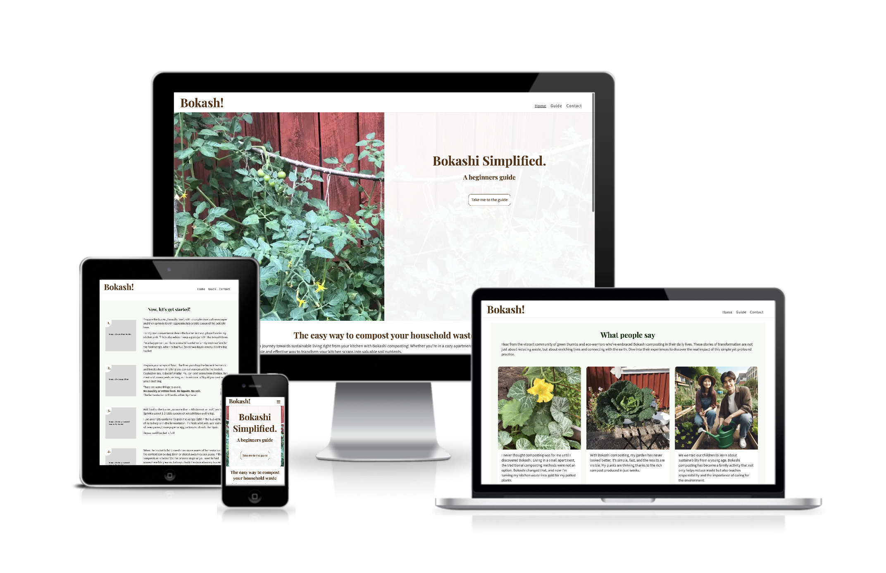

# Bokashi Simplified - A beginners guide
## Introduction

### Project Description
[Bokashi Simplified](https://behemot-biz.github.io/bokashi/)
is a site about bokashi composting, an efficient, anaerobic process that uses a specific group of microorganisms to ferment kitchen waste. 
### Project Purpose
My aim with this site is to demystifie the concept and encourage people to give it a try with a very basic step-by-step guide whithout overwhelming with technical and scientific text.

I use my own knowledge on the subject and I remember how daunted I felt before I actually dared to get going four years ago. 

### Look and feel on different devices

## User stories

User story: As a homeowner I want easy instructions on how to start using the compost method without spending lots of money. 
End user goal: After reading the step-by-step guide I feel confident to start turning my kitchen scrap into new nutrient rich soil 
End business goal: The user actually gives the composting a try.

to be continued...

## Features

### Navigation

The responsive navigation bar on top of the page includes links to the home, guide and contact pages. 
The Bokash! logo is linked to the home (start page). The mavigation bar has the same content and cunctionallity on all pages.
I didn't want to use fontawesome for the "hamburger" menu (small devices), instead I chose to use '&#9776' for &#9776;

### Home (start page)
It starts off with a hero section with a button-link to the step-by-step guide (guide page) followed by a fairly brief introduction to the benefits of using composting method. Below there is a testimonial section with thougths from people using the composting method.

### Guide 
First section gives a short introduktion of the compost technique and the initial cost to start (in sweden).
Second section is the 5-step guide with pictures and textual instructions.

### Contact
Contact form for anyone who wants to get in touch.
The form consists of name, email and message fields as well as send message and reset buttons.

### Footer
For the time beeing the footer only consists of copyright information. Since it doesn't add any value to link it to any social media.

### 404

### Ideas for future implementation
- FAQ on the subject
- Scroll to top for small devices
- Use of responsive images for improved layout (srcset)

## Design decisions
### Fonts
I wanted contrast between headlines and bread text, i used the site fontpair.co for inspiration. 
I decided to use Playfair Display for all headlines and Source Sans 3 for bread text.

A quite funny thing, later when I was looking around for some inspiration I found the same headline font on a swedish site, selling all things needed for bokash composting, bokashi.se, so I guess it was a good choice.

### Colours
I selected brown and shades of green. Brown for the bokashi brans and the good soil it creates. Green for the great food I get when growing in the nutrient soil I get from the compost.

### Imagery
I selected pictures from my own garden as illustrations on the site.

## Technologies

Programs used:
- Vscode (coding html, css)
- Photoshop (croping my images and generating webp files)
- Figma (wireframe/prototyping)

Browsers:
- Firefox
- Chrome
- Safari

Technologies:
- HTML 5
- CSS 3

Web tools:
- [Github](https://behemot-biz.github.io/bokashi/) (repository)
- [Favoicon](https://favicon.io/favicon-generator/#google_vignette) (generate favicon)
- [Fontpair](https://www.fontpair.co/) (find matching fonts)
- [Google fonts](https://fonts.google.com/)
[Am i responsive](https://ui.dev/amiresponsive) (generate image on different devices)
